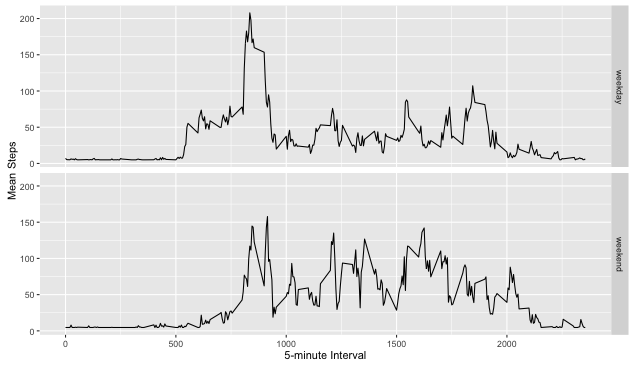

## Loading and preprocessing the data
I used read.csv to load the data from my working directory. I loaded ggplot2, dplyr, zoo and knitr.
```{r}
echo=TRUE
rep <- read.csv("activity.csv")
```

## Tidying data
To tidy the data, I converted the dates column from a character to Dates using the as.Date function.
I also created a new data frame that used na.omit to get rid of NA values.
```{r}
rep <- read.csv("activity.csv")
```

## What is mean total number of steps taken per day?
```{r}
mean(stepsByDay)
#mean = 9354.23
median(stepsByDay)
#median answer = 10395
```
 

## What is the average daily activity pattern?
The 5-minute interval that, on average, contains the maximum number of steps is interval 835 (8:35am)
```{r}
stepsByInterval <- tapply(data$steps, data$interval, mean, na.rm=TRUE)
summary(stepsByInterval)
sort(stepsByInterval)[length(stepsByInterval)]
```
 

## Imputing missing values
I used the na.aggregate from the Zoo library to impute missing step values.
```{r}
library(zoo)
rep$steps<-na.aggregate(rep$steps)
summary(rep)
```

## Are there differences in activity patterns between weekdays and weekends?
While activity starts later in the day on the weekends, it is higher throughout the day than on weekdays.
```{r}
echo = TRUE
rep$week <- weekdays(rep$dates)
rep <- mutate(rep, weekpart = ifelse(week == "Saturday" | week=="Sunday", "weekend", "weekday"))
str(rep)
rep$weekpart <- as.factor(rep$weekpart)
byDay<-aggregate(steps ~ interval+weekpart, data = rep, mean)
head(byDay)

ggplot(byDay, aes(interval, steps)) + 
    geom_line() + 
    facet_grid(weekpart ~ .) +
    xlab("5-minute Interval") + 
    ylab("Mean Steps")
```
 
